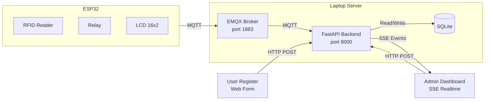

# TapCook — Smart Stove IoT

Sistem kompor pintar dengan kontrol akses RFID, relay remote, dan monitoring arus. ESP32 sebagai perangkat IoT, FastAPI sebagai backend, EMQX sebagai MQTT broker.

## Arsitektur



### Alur Kerja

1. **Tap Kartu** — ESP32 baca UID RFID → kirim via MQTT ke `tapcook/{device_id}/card`
2. **Backend** — cek database: jika dikenal → balas `ok` via `tapcook/{device_id}/auth`; jika baru → buat kode 6-digit (berlaku 10 menit) + kirim event SSE ke admin
3. **ESP32** — terima `ok` → toggle relay ON/OFF; terima `unknown` → tampilkan URL registrasi di LCD
4. **Admin** — dashboard real-time via SSE, lihat kode pending, user terdaftar, kontrol relay, reset WiFi
5. **Web Register** — user masukin kode + nama → kode redeemed → kartu aktif

### Topik MQTT

| Topik | Arah | Format | Keterangan |
|---|---|---|---|
| `tapcook/{id}/card` | ESP32 → Backend | `{"uid":"..."}` | RFID terdeteksi |
| `tapcook/{id}/auth` | Backend → ESP32 | `{"status":"ok","uid":"...","name":"..."}` | Auth berhasil |
| | | `{"status":"unknown","uid":"..."}` | Kartu baru |
| `tapcook/{id}/cmd` | Backend → ESP32 | `{"cmd":"relay_on"}` | Nyalakan relay |
| | | `{"cmd":"relay_off"}` | Matikan relay |
| | | `{"cmd":"reset_wifi"}` | Reset WiFi ke mode config |
| `tapcook/{id}/status` | ESP32 → Backend | `{"relay":true}` | Status relay terkini |

## Prasyarat

- **Python 3.10+** + `pip3`
- **Docker** (untuk EMQX MQTT broker)
- **PlatformIO** (VS Code + extension, atau CLI) untuk upload firmware ESP32
- **ESP32 dev board** + MFRC522 RFID + relay 1 channel + LCD I2C 16x2 + ACS712 current sensor

## Setup

### 1. Cepat (Automated)

```bash
bash setup.sh
```

Script akan:
- Buat Python virtual environment + install dependencies
- Pull & run EMQX Docker container
- Deteksi IP laptop → update `src/config.h`
- Start backend di `http://localhost:8000`

### 2. Manual

#### Backend

```bash
# Virtual env
cd backend
python3 -m venv venv
source venv/bin/activate
pip install -r requirements.txt

# EMQX (MQTT broker)
docker run -d --name tapcook_emqx -p 1883:1883 -p 18083:18083 emqx:5.8

# Start backend
uvicorn main:app --host 0.0.0.0 --port 8000 --reload
```

Backend siap di `http://localhost:8000`.

#### ESP32 Firmware

1. Buka folder proyek di VS Code (dengan PlatformIO extension)
2. Edit `src/config.h`:
   - `MQTT_HOST` → ganti dengan IP laptop server (misal `"192.168.1.10"`)
   - `DEVICE_ID` → boleh ganti kalau lebih dari 1 ESP32
3. Upload:
   ```bash
   pio run --target upload
   ```
4. Buka Serial Monitor (`pio device monitor` atau via VS Code) untuk lihat log

Pada first boot, ESP32 akan masuk **Config Mode** (WiFi AP: `TAPCOOK-XXXX`). Hubungkan HP/laptop ke AP tersebut, buka browser ke `192.168.4.1`, pilih WiFi rumah, masukkan password. Setelah connect, ESP32 restart dan siap digunakan.

### 3. Update IP (kalau pindah WiFi / laptop restart)

ESP32 perlu dikasih tahu IP baru server. Caranya:
- Di admin dashboard: klik **Reset WiFi** → ESP32 restart ke Config Mode
- Atau hapus NVS: tombol flash sambil power-up (sesuai implementasi)
- Ulangi proses setup WiFi seperti first boot

> **Atau** upload ulang firmware setelah update `src/config.h` dengan IP baru.

## Penggunaan

### Register Kartu Baru

1. Tap kartu RFID ke ESP32
2. LCD tampilkan `tinyurl.com/tc-regis` (atau langsung buka `http://[IP_SERVER]:8000`)
3. Admin dashboard akan muncul kode 6-digit baru (berlaku 10 menit)
4. User buka halaman registrasi, masukkan kode + nama
5. Berhasil — kartu terdaftar
6. Tap kartu lagi → relay ON (atau OFF jika sudah ON)

### Admin Dashboard

Buka `http://[IP_SERVER]:8000/admin`:

| Fitur | Fungsi |
|---|---|
| ⏳ Pending | Daftar kode registrasi aktif + countdown |
| 👥 Terdaftar | User yang sudah terdaftar, bisa hapus |
| ⚡ Relay | Tombol ON/OFF relay remote (real-time via MQTT) |
| 🔌 Reset WiFi | Reset ESP32 ke Config Mode |

### Relay Control

- **Tap kartu terdaftar** — toggle relay ON/OFF (hanya kartu yang sama bisa matikan)
- **Tombol Relay di Admin** — ON/OFF dari web (tidak terikat kartu)
- **Monitoring** — LCD menampilkan arus AC (A) saat relay ON

## Troubleshooting

| Gejala | Kemungkinan | Solusi |
|---|---|---|
| ESP32 gak connect MQTT | IP server berubah | Cek `MQTT_HOST` di `src/config.h`, upload ulang atau Reset WiFi |
| Admin dashboard "Menunggu..." | ESP32 offline / MQTT disconnect | Cek Serial Monitor ESP32, cek `docker ps` EMQX |
| Tap kartu gak respon | MQTT broker mati | `docker start tapcook_emqx`, restart backend |
| Kode pending gak hilang | Timezone mismatch | Refresh halaman admin; kode expired bakal otomatis kehapus |
| LCD blank / error | Address I2C berbeda | Cek `i2cdetect` atau ganti `0x27` di `main.cpp` |

## Struktur Proyek

```
tapcook/
├── backend/
│   ├── main.py              # FastAPI server (routes, MQTT, SSE)
│   ├── database.py          # SQLAlchemy models + SQLite
│   ├── requirements.txt     # Python dependencies
│   ├── templates/
│   │   ├── admin.html       # Admin dashboard
│   │   └── register.html    # Halaman registrasi user
│   └── start.sh             # Script start backend
├── src/
│   ├── main.cpp             # Firmware ESP32
│   └── config.h             # WiFi/MQTT konfigurasi
├── platformio.ini           # PlatformIO config
├── docker-compose.yml       # Docker services (opsional)
├── setup.sh                 # Auto setup script
└── _ref/                    # Dokumen referensi tugas
```

## Matikan Semua Service

```bash
docker stop tapcook_emqx
# atau kill backend:
pkill -f "uvicorn main:app"
```
